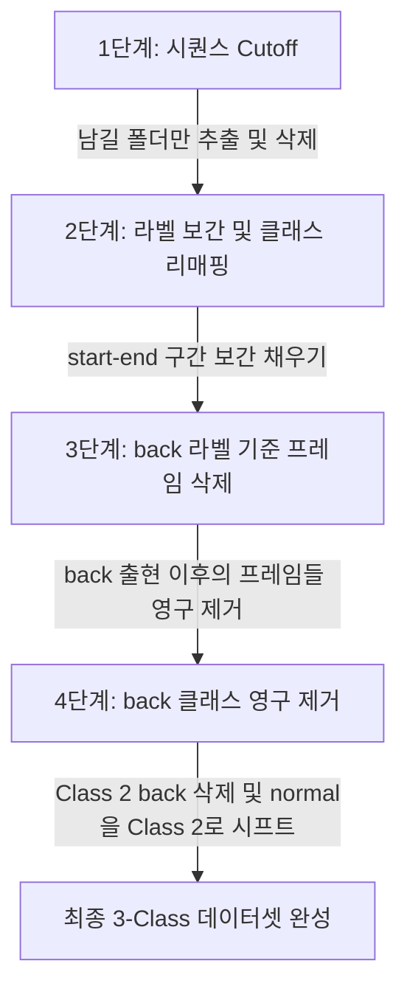

# 통합 데이터셋 전처리 보고서 (Step 1 ~ Step 4 완료)

이 문서는 데이터셋의 시퀀스 정리(1단계), 라벨 보간 및 클래스 매핑(2단계), `back` 라벨 기준 프레임 컷오프(3단계), 그리고 `back` 클래스 최종 제거(4단계)까지의 전체 전처리 내역을 하나로 통합한 보고서입니다.

---

## 1. 전처리 단계별 요약

전체 전처리 과정은 다음과 같이 4단계에 걸쳐 실행되었습니다.

### 1.1 Step 1: 시퀀스 개수 조정 (Cutoff)
YOLO 학습의 효율성을 위해 각 데이터셋의 시퀀스(디렉터리) 개수를 제한하고 `train.txt`를 갱신했습니다.
* **smart_climb**: `intrusion_climb-over-fence_rgb_0107_cctv1`까지 10개 보존 (70개 삭제)
* **plant_climb**: `intrusion_climb-over-fence_rgb_0054_cctv1`까지 10개 보존 (70개 삭제)
* **normal_plant**: `intrusion_normal_rgb_0166_cctv1`까지 20개 보존 (80개 삭제)

### 1.2 Step 2: 라벨 보간 (Interpolation)
작업자 행동의 상태 지속 구간을 채우기 위해 `start` 라벨과 `end` 라벨 사이의 모든 중간 프레임들에 타겟 클래스(`unsafe` 및 `danger`)를 선형 보간하여 채워 넣었습니다.

### 1.3 Step 3: `back` 라벨 기준 프레임 삭제
이탈/복귀를 의미하는 `back` 라벨이 감지된 프레임 번호 $N$을 기준으로, 그 이후 프레임($K > N$)들을 디스크 및 `train.txt` 목록에서 삭제하여 불필요한 후반부 공백 영상을 잘라냈습니다.
* **plant_climb 데이터셋 내 5개 시퀀스에서 총 201장의 프레임이 영구 삭제**되었습니다.

### 1.4 Step 4: `back` 클래스 완전 제거 및 클래스 축소
정제 기준선으로 삼았던 `back` 클래스 자체도 최종 분류 데이터셋에서 완전히 삭제하였습니다. 
* 파일 내 `back` (기존 Class 2) 라인을 모두 지우고, `normal` (기존 Class 3)을 **Class 2**로 한 칸씩 시프트하여 최종적으로 3개 클래스 구조로 축소하였습니다.
* `back`이 지워져 빈 파일이 된 프레임은 `normal` (Class 2) 라벨(`2 0.5 0.5 1.0 1.0`)로 채웠습니다.

---

## 2. 최종 전처리 완료 후 데이터셋 통계

전처리가 모두 끝난 후, 각 데이터셋 내에서 실제 클래스들이 몇 개의 프레임에 분포되어 있는지 확인한 통계 결과입니다.

| 데이터셋명 | 최종 보존 시퀀스 수 | 최종 프레임(파일) 수 | unsafe (0) | danger (1) | normal (2) | `train.txt` 라인 수 |
| :--- | :---: | :---: | :---: | :---: | :---: | :---: |
| **smart_climb** | 10개 | 4,576장 | 4,419장 | 3,935장 | 157장 | **4,576줄** |
| **plant_climb** | 10개 | 2,754장 | 2,753장 | 2,512장 | 1장 | **2,754줄** |
| **normal_plant** | 20개 | 3,734장 | 248장 | 0장 | 3,486장 | **3,734줄** |
| **합계** | **40개** | **11,064장** | **7,420장** | **6,447장** | **3,644장** | **11,064줄** |

---

## 3. 데이터 포맷 유효성 확인
기존 검증용 스크립트인 `validate_labels.py`를 실행하여 포맷 무결성을 점검한 결과, 정제된 모든 라벨 파일이 에러나 경고 없이 정상 규격(0~2 범위 내 클래스 ID, 5개 파트 규격)을 만족함을 확인했습니다.
